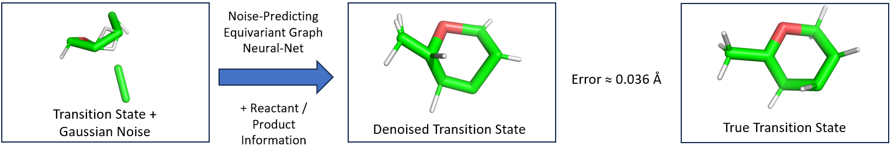

# Diffusion Models for Optimised Geometry Prediction 

[](LICENSE.txt)
[](https://www.rdkit.org/)


<!-- 
 -->


This repository contains the code for implementing Sacha Raffaud's IRP project titled "Diffusion Models for Optimised Geometry Prediction".

## Background

### Transition State Optimisation

In this project, transition state optimisation involves generating accurate 3D representations of transition states. This is achieved by using reactant and product coordinates along with atom types. Optionally, reaction graphs can also be used as input, currently available with the initial W93 Dataset.


<div align="center">
  <div style="display: flex; justify-content: center;">
    <div style="margin-right: 20px;">
      
    </div>
    <div>
      <figure style="margin: 0;">
        
        <figcaption style="text-align: center;"></figcaption>
      </figure>
    </div>
  </div>
</div>

### Equivariant Graph Neural Networks (EGNN)

EGNNs are graph neural networks (GNN) that maintain equivariance to transformations. This means that the output of the network transforms in the same manner as the input when transformed prior to feeding it into the GNN.

<div>
  
</div>

### Equivariant Diffusion Models

After establishing a denoising framework, it can be applied iteratively in a diffusion model. In diffusion models, the process involves a forward diffusion, where noise is incrementally added to the input sample until it conforms to an isotropic Gaussian distribution. This is followed by a learnable backward diffusion, where noise is subtracted to reconstruct the original data. This iterative backward process enables high-quality data generation and is what we are trying to optimise to allow for accurate TS generation.

For detailed background and results, please refer to Sacha's thesis.

## Project Objectives

1. Adapt an EGNN network for denoising.
2. Implement this network within an equivariant diffusion process.
3. Enhance reaction/product information with additional chemical context.
4. Conduct ablation studies on the necessity of product information.
5. Explore the supplementation/replacement of reaction and product information with reaction graphs.

## Datasets

Three main datasets were employed in this project for comprehensive comparisons: W93, TX1, and RGD1 datasets. All datasets used DFT to generate the transition states.

### W93 Dataset - Elementary Reactions of Gas-Phase Compounds [^1]

- Initial reaction conformation dataset with transition states.
- Around 12,000 high precision samples.
- Used with the TS-Diff model.

### TX1 Dataset - Transition X Dataset [^2]

- Built upon W93 with re-optimised transition states.
- Represents an improved version of W93.
- Used with the OA-ReactDiff model.

### RGD1 Dataset - Reaction Graph Depth One Dataset [^3]

- New dataset with over 176,000 samples.
- Features multiple transition state conformations.
- Includes larger molecules and offers new insights.

The primary dataset used is W93, comprehensively tested with PyTest. The other datasets have limited tests due to large .h5 files.

# Repository Overview

The main source files are located in the `src` directory, containing the following essential files:

- `train_test.py`: Script for training and testing diffusion models.
- `lightning_setup.py`: PyTorch Lightning class for diffusion models.
- `evaluate_samples.py`: Script for evaluating generated samples.

Subdirectories within `src` include `Diffusion` and `EGNN`, housing appropriate backbones for respective models. All dataset classes and setup files are in the `data` directory.

Documentation can be found in the `docs` directory within a file called `TS-DiffuGen-Documentation.pdf`.

# Training and Testing with Configuration Files

To facilitate seamless model training and testing, all operations are conducted through configuration files. Below is a brief overview of the various parameters that can be used within each diffusion model:

- **`train_test`**: Choose between 'Train' or 'Test': This directive controls whether a diffusion model should be trained or tested.
- **`use_graph_in_model`**: Boolean: Determines whether a reaction graph should be integrated into the model.
- **`dataset_to_use`**: Choose between 'W93', 'TX1', or 'RGD1': Specifies the dataset for training/sampling.
- **`timesteps`**: int: Dictates the number of diffusion steps to employ.
- **`noise_schedule`**: Choose between 'sigmoid_2', 'sigmoid_5', or 'cosine': Designates the noise schedule to employ.
- **`remove_hydrogens`**: Boolean: Determines whether hydrogens should be included.
- **`random_rotations`**: Boolean: Dictates whether random rotations should be applied during training.
- **`augment_train_set`**: Boolean: Controls whether the training set should be augmented by replacing reactants with products.
- **`include_context`**: Choose between None, 'Nuclear_Charges', 'Activation_Energy', or 'Van_Der_Waals': Specifies the type of context to incorporate.
- **`remove_product`**: Boolean: Controls whether product coordinates are incorporated.
- **`lr`**: float: Learning rate control.
- **`epochs`**: int: Number of training epochs.
- **`batch_size`**: int: Batch size for processing.
- **`learning_rate_scheduler`**: Boolean: Determines whether a scheduler should be utilized for learning rate.
- **`model_name`**: str: Model name for identification with WandB during training.
- **`folder_name`**: str: Name of the folder within the `trained_models` directory.
- **`wandb_project_name`**: str: Name of the project in WandB.
- **`n_layers`**: int: Number of EGNN layers in the diffusion model.
- **`hidden_features`**: int: Size of the embedding for hidden node features.

Example configuration files are available in the `configs` directory.

## Code Descriptions and Adaptations

Each Python file and script includes a header at the top, providing information about its contents. Additionally, there's a reference to any adaptations made from previous codebases.

- The EGNN model used was adapted from [^4].
- The Diffusion Backbone was adapted from [^5].

# Usage:

**Note:** A GPU is **HIGHLY** recommended as these diffusion models are compute intensive.

## Tested Configuration

The TS-DiffuGen package has been thoroughly tested on the following system configuration:

| **Operating System** | **Python Version** | **PyTorch Lightning Version** | **PyTorch CUDA Version**   |
|----------------------|--------------------|-------------------------------|--------------------------|
| Ubuntu               | 3.10.10            | 2.7.7                         | 2.0.1+cu117              |


## Setting up the Package: 

1. Clone the repository

```shell
git clone https://github.com/schwallergroup/TS-DiffuGen.git
```
2. Navigate to the root repository:

```shell
cd TS-DiffuGen
```

3. Create the Conda environment (~ 4 minutes due to large imports):

```shell
conda env create -f environment.yml
```

4. Activate the environment: 

```shell
conda activate tsdiff
```

5. Create the package: 

```shell
python setup.py install
```

6. Download the datasets and enjoy the package!

## Setting up the datasets:

### Setting up the W93 Dataset: 

To set up the W93 dataset, follow these steps:

1. Download the compressed Tar file `wb97xd3.tar.gz` from the following link: [W93 Dataset Link](https://zenodo.org/record/3715478)
2. Place the downloaded file in the `data/Dataset_W93/data/w93_dataset/` directory.
3. Create a `TS` directory with the following command: 
    
     ```shell
    mkdir data/Dataset_W93/data/TS
     ```

4. Uncompress the .tar file into the TS directory using the following command: 

     ```shell
     tar -xvf data/Dataset_W93/data/w93_dataset/wb97xd3.tar.gz -C data/Dataset_W93/data/TS/
     ```

5. Run the `setup_dataset_files.py` script to process and organise the dataset using the following command (Will take ~ 3 minutes): 

    ```shell
    python data/Dataset_W93/setup_dataset_files.py
    ```

### Setting up the TX1 Dataset: 

To set up the TX1 dataset, follow these steps:

1. Download the Transition1x.h5 file from the following link: [TX1 Dataset Link](https://zenodo.org/record/3715478)
2. Place the file in the  `data/Dataset_TX1` directory


### Setting up the RGD1 Dataset:

To set up the RGD1 dataset, follow these steps:

1. Download the RGD1_CHNO.h5 file from the following link: [RGD1 Dataset Link](https://doi.org/10.6084/m9.figshare.21066901.v6)
2. Place the file in the  `data/Dataset_RGD1` directory
3. Run the `parse_data.py` script with the following command:

    ```shell
    python data/Dataset_RGD1/parse_data.py
    ```


## WandB in Your Environment

The training of diffusion models is enhanced with the integration of Weights and Biases (WandB). WandB enables real-time, continuous monitoring of the training process. If WandB is not yet setup in your environment, when you train your first diffusion model, you will be asked to input a WandB API key. 

If you do not already have an account, you can make one through the following link: [WandB](https://wandb.ai/)


## Training a new Diffusion Model:

1. Change the parameters in the `configs/train_diffusion.yml` configuration file to your liking.
2. Run the following command to train a new diffusion model:

    ```shell
    python src/train_test.py --config configs/train_diffusion.yml
    ```

## Sampling from test set using a trained Diffusion Model:

Similarly to when training, a testing config file should be adapted which points to the location of the trained diffusion model, includes the number of samples it should generate and matches the parameters used in the training process. Samples from the test set can then be generated using the following command: 
      
```
python src/train_test.py --config configs/test_diffusion.yml
```

### Sampling from Pre-trained Diffusion Models

#### Pre-trained Graph Model

The `pre-trained_graph` model was trained with the following parameters:

- Uses Reaction Graphs
- Does not use Product Coordinates
- Sampling Steps: 1,000
- EGNN Layers: 8
- Hidden Features: 64
- Noise Schedule: Sigmoid_2

#### Pre-trained Simple Model

The `pre-trained_simple` model was trained with the following parameters:

- Dataset: TX1
- Without Reaction Graphs
- Uses Product Coordinates
- Sampling Steps: 2,000
- EGNN Layers: 8
- Hidden Features: 64
- Noise Schedule: Sigmoid_2

You can use these pre-trained models to generate samples using the provided commands:


1. Run the following script with the chosen testing config file:
    ```
    python src/train_test.py --config configs/test_pre_trained_diffusion_simple.yml
    ```
    or
    ```
    python src/train_test.py --config configs/test_pre_trained_diffusion_with_graphs.yml
    ```

2. Samples from the test set will be generated within the chosen model's Samples directory. This should take around 2 hours for the whole test set.


### Evaluating Samples

All generated samples should be created within a designated `Samples` directory. A path to this directory will be used within the evaluation script.

The evaluation script calculates the COV (Coverage) and MAT (Matching) scores for the generated samples, using thresholds of 0.1 and 0.2 Å. Formulas for these metrics can be found in Sacha's thesis.

The evaluation script can be executed with the following command: 

```shell
python src/evaluate_samples PATH_TO_SAMPLES_DIRECTORY
```
This command will trigger the evaluation process and display the computed COV and MAT scores on the screen.


## Visualisation with PyMol

To use PyMol for visualisation:

1. Ensure PyMol is installed on your desktop along with the appropriate license. You can download it from [this link](https://pymol.org/2/).
2. Place the PyMol script in the designated folder and execute it using the PyMol GUI.

# Testing of the Code in This Repository

Testing for this project has been conducted using the PyTest framework. Thorough testing has been performed on the W93 dataset. Testing for the other two datasets requires the download of `.h5` files.

All critical functions, classes, and methods from various scripts have been rigorously tested and are located in the `/tests` directory. These tests are expected to pass successfully as part of the repository's workflow. If you intend to run these tests on your local machine, execute the following command:


```shell
pytest tests/
```

## References

[^1]: Grambow, C. A., Pattanaik, L., & Green, W. H. (2020). "Reactants, products, and transition states of elementary chemical reactions based on quantum chemistry." *2020.* [Link](https://doi.org/10.1038/s41597-020-0460-4)

[^2]: Schreiner, M., Bhowmik, A., Vegge, T., Busk, J., & Winther, O. (2022). Transition1x - a dataset for building generalisable reactive machine learning potentials. Scientific Data, 9(1), 779. [Link](https://doi.org/10.1038/s41597-022-01870-w)

[^3]: Zhao, Q., Vaddadi, S. M., Woulfe, M., Ogunfowora, L. A., Garimella, S. S., Isayev, O., & Savoie, B. M. (2023). Comprehensive exploration of graphically defined reaction spaces. Scientific Data, 10(1), 145. [Link](https://doi.org/10.1038/s41597-023-02043-z)

[^4]: Satorras, V. G., Hoogeboom, E., & Welling, M. "E(n) Equivariant Graph Neural Networks." *February 2021.* [arXiv](https://arxiv.org/abs/2102.09844).

[^5]: Hoogeboom, E., Satorras, V. G., Vignac, C., & Welling, M. "Equivariant Diffusion for Molecule Generation in 3D." *March 2022.* [arXiv](https://arxiv.org/abs/2203.05541).

