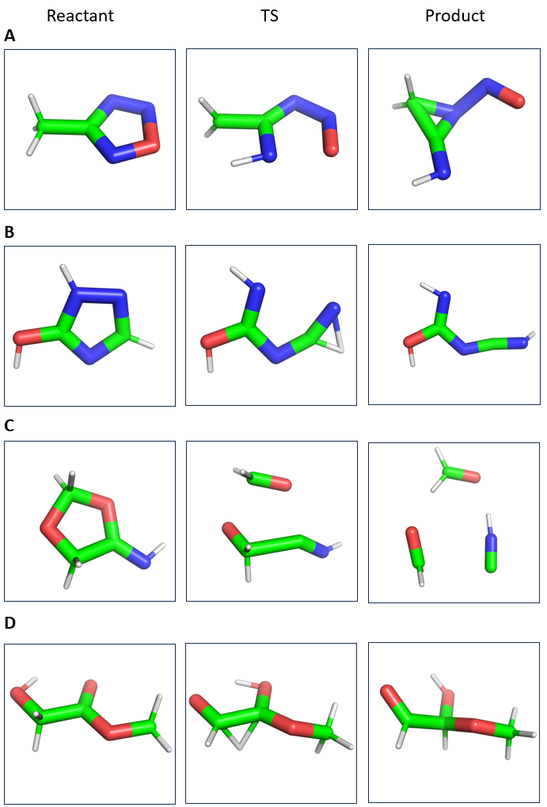

# Diffusion Models for Optimised Geometry Prediction

This repository contains the code for implementing

## Transition State optimisation

In the context of this project, transition state optimization refers to finding the most accurate 3D geometry depending on reactant and product constraints.

  

### More Examples:

  <figure>
    
    <figcaption>Transition state optimisation</figcaption>
  </figure>

## Explain topic a bit

<!-- Add explanation here -->

### Datasets: 

- W93 Dataset (Same as TS-DIFF paper):

The dataset used in this project comprises of W93 DFT simulations etc etc ect. It is a collection of different chemical reaction pathways and associated geometries.

Dataset contains ZZZ: 

  

### Setting up the W93 Dataset: 

To set up the dataset, follow these steps:

1. Download the compressed Tar file `wb97xd3.tar.gz` from the following link: [W93 Dataset Link](https://zenodo.org/record/3715478)
2. Place the downloaded file in the `Dataset_W93/data/w93_dataset` directory.
3. Uncompress the .tar file into the TS directory using the following command: `tar -xvf Dataset_W93/data/w93_dataset/wb97xd3.tar.gz -C Dataset_W93/data/TS/
`
4. Run the `setup_dataset_files.py` script to process and organize the dataset.

- Transition1X Dataset (Same as OA-ReactDiff):

The dataset comprises of XXX

### Setting up the TX1 Dataset:

To set up the dataset, follow these steps:

1. Download the Transition1x.h5 file from [TX1 Dataset Link](https://zenodo.org/record/3715478).
2. Place the dataset file in the  `Dataset_TX1` directory. 

## Denoising EGNN Backbone

  

Process: 

1. 
2. 
3. 

## Equivariant Diffusion

Process:

1. 
2. 
3. 

<!-- Add diffusion process details here -->

### Other scripts

#### Visualisation with PyMol: 

1. Make sure to have PyMol installed on the Desktop with the appropriate license: [PyMol Download Link](https://pymol.org/2/).
2. Then place PyMol Script in the appropriate folder and run it from the PyMol GUI. 

## Code Adaptations

1. Code for the EGNN was adapted from  [E(n) Equivariant Graph Neural Networks](https://github.com/vgsatorras/egnn) [^1]
2. Code for the Variational Diffusion was adapted from [ E(3) Equivariant Diffusion Model for Molecule Generation in 3D](https://github.com/ehoogeboom/e3_diffusion_for_molecules/tree/main) [^2]

# Running the Package: 

1. Clone the repository

``$ git clone https://github.com/schwallergroup/DiffSach.git``

2. Travel to the root repository: 

``$ cd DiffSach``

3. Create the Conda environment:

``$ conda env create -f environment.yml``

4. Activate the environment: 

``$ conda activate tsdiff``

5. Create the package: 

``$ python setup.py install``

6. Download the datasets and enjoy the package!

## References

[^1]: Victor Garcia Satorras, Emiel Hoogeboom, and Max Welling. "E(n) Equivariant Graph Neural Networks." February 2021. [arxiv](https://arxiv.org/abs/2102.09844).

[^2]: Emiel Hoogeboom, Victor Garcia Satorras, Clément Vignac, and Max Welling. "Equivariant Diffusion for Molecule Generation in 3D." March 2022. [arxiv](https://arxiv.org/abs/2203.05541).

